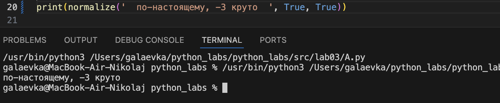
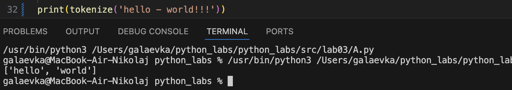
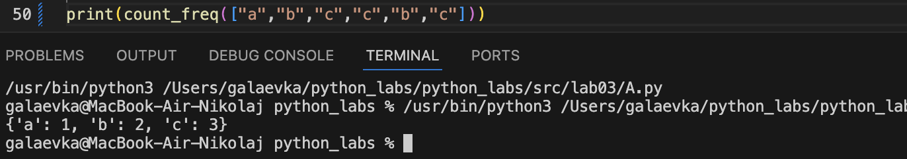
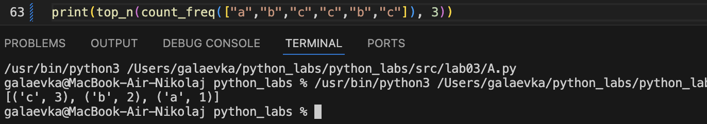

<h1>Задание А<h1>

## normalize
```python
def normalize(text, casefold, yo2e):
    if yo2e:
        text = text.replace('ё', 'е')
        text = text.replace('Ё', 'Е')

    if casefold:
        text = text.casefold()

    text = text.replace('\n', ' ')
    text = text.replace('\t', ' ')
    text = text.replace('\r', ' ')

    text_lst = text.split()

    normalize_text = ''
    for i in text_lst:
        normalize_text += i + ' '

    return normalize_text.strip()
print(normalize('  по-настоящему, -3 круто  ', True, True))
```


## tokenize
```python
def tokenize(text):
    base = text.replace('.', ' ').replace(',', ' ').replace('!', ' ').replace(':', ' ').replace(';', ' ').replace('?', '')
    base = base.split()
    ans = []

    for i in base:
        if i[0].isdigit() == 0 and i[0].isalpha() == 0: pass
        else:
            ans.append(i)
    return ans
print(tokenize('hello - world!!!'))
```


## count_freq
```python
def count_freq(lst):
    ans_items = []
    ans_keys = []
    ans = {}

    for i in lst:
        if i in ans_items: pass
        else: ans_items.append(i)

    for j in ans_items:
        ans_keys.append(lst.count(j))
    
    for k in range(len(ans_keys)):
        ans.update({ans_items[k] : ans_keys[k]})

    return ans
print(count_freq(["a","b","c","c","b","c"]))
```


## top_n
```python
def top_n(dict, n):
    ans = sorted(list(dict.items()), key=lambda x: (-x[1], x[0]))
    return ans[:n]
print(top_n(count_freq(["a","b","c","c","b","c"]), 3))
```


<h1>Задание B<h1>

## Работа с отдельным текстовым файлом

> текст находиться в файле [text](/Users/galaevka/python_labs/python_labs/src/lab03/text), функции лежат в файле [A](/Users/galaevka/python_labs/python_labs/src/lab03/A.py)

```python
from A import normalize, tokenize, count_freq, top_n
fl = open('/Users/galaevka/python_labs/python_labs/src/lab03/text', encoding='utf-8').readline()
fl = normalize(fl, True, True)

print('\n')

print(fl)

print('\n')

print(f'Всего слов: {len(tokenize(fl))}')
print(f'Уникальных слов: {len(set(tokenize(fl)))}')
print('Top-5:')
for i in top_n(count_freq(tokenize(fl)), 5):
    print(f'{i[0]}:{i[1]}')
```
